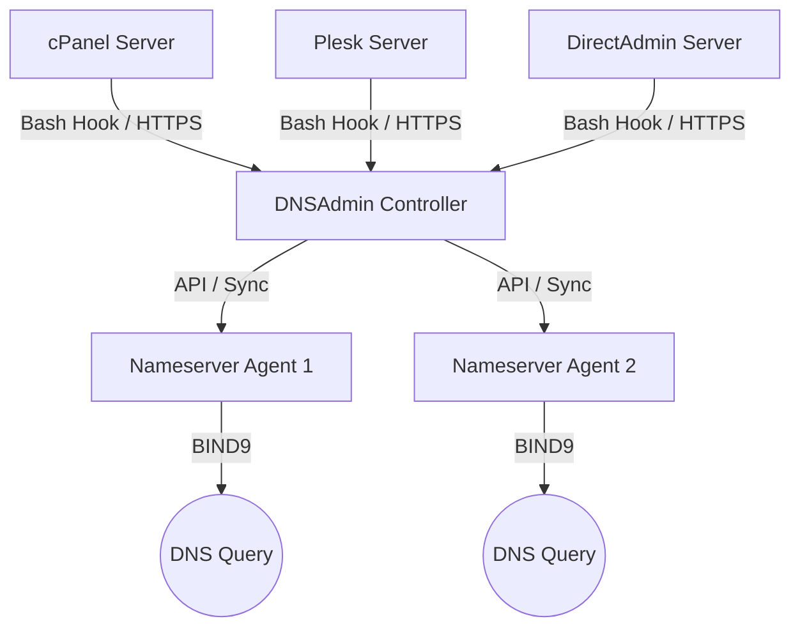

# DNSAdmin

DNSAdmin is a secure, light-weight, centralized DNS management system designed for web hosting providers and infrastructure administrators. It enables real-time synchronization of DNS zones from multiple web hosting servers (cPanel, Plesk, DirectAdmin) to multiple dedicated BIND 9 nameserver nodes.

---

## System Architecture



---

## Key Features

*   **Centralized DNS Synchronization:** Add, update, or remove zone entries across multiple remote nameserver nodes simultaneously.
*   **MySQL Database Backend:** Utilizing a high-performance, connection-pooled MySQL/MariaDB database for data persistence.
*   **Light-weight Dedicated Installers:** One-click script installers for controller, nameserver nodes, and hosting integrations.
*   **Theme Engine:** Dashboard featuring a persistent light and dark theme mode.
*   **Real-time OS Metrics:** Agent reports CPU and memory statistics parsed directly from Linux procfs files on 60-second intervals.
*   **Enforced Security Flow:** Secure password reset required on first login using randomly generated administrative credentials.
*   **Control Panel Hooks:** Zero-dependency, pure Bash hook scripts to capture zone updates from cPanel, Plesk, and DirectAdmin.

---

## Installation Guide

Follow these steps in order to set up your DNSAdmin cluster.

### 1. Central Controller Setup (Master Server)
Execute these commands on a clean Debian/Ubuntu or RHEL/CentOS/AlmaLinux server to install Node.js, MariaDB (MySQL), configure credentials, and start the control panel:

**Option A: Download and run (Recommended)**
```bash
wget -O install.sh "https://raw.githubusercontent.com/bburakguldogan/dnsadmin/main/install.sh?v=2"
chmod +x install.sh
./install.sh --role controller --port 80 --notify-port 53
```

**Option B: One-click installation**
```bash
curl -sS https://raw.githubusercontent.com/bburakguldogan/dnsadmin/main/install.sh?v=2 | bash -s -- --role controller --port 80 --notify-port 53
```

*   **First Login Credentials:** During setup, a random 16-character administrator password is generated and saved in `/opt/dnsadmin-controller/admin_credentials.txt`.
*   **Forced Security Reset:** Upon logging in for the first time, you will be forced to specify a secure email address and update your password before gaining access to the dashboard.

---

### 2. DNS Nameserver Node Agent Setup (ns1 / ns2)
First, add your nameserver node in the central dashboard under the "DNS Nodes" tab to generate a unique **Node Token**. Then, run the following commands on your nameserver server:

**Option A: Download and run (Recommended)**
```bash
wget -O install-node.sh "https://raw.githubusercontent.com/bburakguldogan/dnsadmin/main/install-node.sh?v=2"
chmod +x install-node.sh
./install-node.sh --controller-url http://<your-controller-ip>:80 --token <node-token-from-panel> --ns-name ns1.yourdomain.com
```

**Option B: One-click installation**
```bash
curl -sS https://raw.githubusercontent.com/bburakguldogan/dnsadmin/main/install-node.sh?v=2 | bash -s -- \
  --controller-url http://<your-controller-ip>:80 \
  --token <node-token-from-panel> \
  --ns-name ns1.yourdomain.com
```

*   If BIND 9 is not installed on the node, the installer will automatically provision BIND 9 packages, start the daemon, and link the configuration files.

---

### 3. Hosting Server Integrations (Hooks)
Add your hosting server under the "Hosting Servers" tab to obtain a **Server API Key**. Then run the corresponding hook installer script on your hosting server:

#### A. cPanel / WHM Integration
```bash
wget -O install-cpanel.sh "https://raw.githubusercontent.com/bburakguldogan/dnsadmin/main/install-cpanel.sh?v=2"
chmod +x install-cpanel.sh
./install-cpanel.sh --controller-url http://<your-controller-ip>:80 --token <server-api-key-from-panel>
```

#### B. Plesk Integration
```bash
wget -O install-plesk.sh "https://raw.githubusercontent.com/bburakguldogan/dnsadmin/main/install-plesk.sh?v=2"
chmod +x install-plesk.sh
./install-plesk.sh --controller-url http://<your-controller-ip>:80 --token <server-api-key-from-panel>
```

#### C. DirectAdmin Integration
```bash
wget -O install-directadmin.sh "https://raw.githubusercontent.com/bburakguldogan/dnsadmin/main/install-directadmin.sh?v=2"
chmod +x install-directadmin.sh
./install-directadmin.sh --controller-url http://<your-controller-ip>:80 --token <server-api-key-from-panel>
```

---

## Configuration & Environment Variables

The controller and agent daemons read configuration overrides from the following environment variables:

### Controller Variables
*   `PORT`: Port for the admin web panel (default: `5380`)
*   `NOTIFY_PORT`: UDP port to listen for DNS NOTIFY messages (default: `5353`)
*   `MYSQL_HOST`, `MYSQL_PORT`, `MYSQL_USER`, `MYSQL_PASSWORD`, `MYSQL_DATABASE`: Credentials for database access.
*   `JWT_SECRET`: Signature key for encoding API authorization tokens.

### Node Agent Variables
*   `PORT`: Agent daemon API listener port (default: `5300`)
*   `DNSADMIN_TOKEN`: Authentication token verifying requests sent by the Controller.
*   `DNSADMIN_CONTROLLER_URL`: URL pointing to the central controller.
*   `NODE_NAME`: Node hostname reported to the controller (default: system hostname).
*   `RELOAD_CMD`: Shell command triggered to reload BIND 9 configurations.

---

## Licensing & Code Obfuscation (Lisanslama ve Kod Şifreleme)

To protect the intellectual property of DNSAdmin, a hybrid licensing system is integrated. The licensing logic uses Node.js Express middleware calling an obfuscated local PHP verification script, which queries a central licensing server database.

### 1. Central Licensing Server Setup (Yönetici Lisans Sunucusu)
Upload the files in `licensing_server/` to your central hosting (e.g., `https://licensing.yourcompany.com`):
*   `index.php`: The Admin Web Control Panel. Configure your secure admin password via the `$adminPassword` variable at the top.
*   `check.php`: The client verification endpoint. Connects to `database.db` (SQLite) automatically.
*   `api.php`: The WHMCS-compatible provisioning API. Authenticates requests via the `$apiKey` defined at the top.

#### Administrative CLI Commands (`admin.php`):
Run these commands on your licensing server to manage keys programmatically:
```bash
# Add or update a license (IP and expiry date)
php admin.php add 185.123.45.67 2027-12-31

# Suspend a license
php admin.php suspend 185.123.45.67

# Reactivate a suspended license
php admin.php resume 185.123.45.67

# Delete a license
php admin.php delete 185.123.45.67

# List all licenses
php admin.php list
```

#### WHMCS API Integration:
Provide the API URL and your secure `$apiKey` in your provisioning modules:
*   **Create/Update:** `https://licensedomain.com/api.php?api_key=KEY&action=create&ip=IP&expires=YYYY-MM-DD`
*   **Suspend:** `https://licensedomain.com/api.php?api_key=KEY&action=suspend&ip=IP`
*   **Unsuspend:** `https://licensedomain.com/api.php?api_key=KEY&action=unsuspend&ip=IP`
*   **Terminate:** `https://licensedomain.com/api.php?api_key=KEY&action=terminate&ip=IP`
*   **Status:** `https://licensedomain.com/api.php?api_key=KEY&action=status&ip=IP`

---

### 2. Client Code Obfuscation (İstemci Kod Şifreleme)
To prevent customers from reverse-engineering the licensing logic or modifying the Node.js middleware:

#### A. Obfuscating the PHP License Verifier
The client-side verifier script `license_check.src.php` contains the shared cryptographical secret key and queries your central license server URL. To encrypt this file:
```bash
# Squeezes code, obfuscates variables, base64 encodes and eval-packs license_check.php:
node controller/obfuscator.js
```

#### B. Obfuscating the Node.js Controller Backend (Production Build)
To compile and encrypt the entire Node.js Express server:
```bash
# Creates a 'dist/' folder containing fully obfuscated production JS files:
node controller/build.js
```
*   **Important:** Müşterilerinize panel dağıtımı yaparken, orijinal kodlar yerine yalnızca **`controller/dist/`** klasörünün içindekileri teslim edeceksiniz.

---

## Sürüm Notları ve Güncellemeler (Changelog & Update Guide)

Bu bölüm, sisteme eklenen yeni özellikleri ve bunların sunucularınızda nasıl çalıştırılacağını listeler.

### [Sürüm 1.1.0] - 2026-07-11
#### Eklenen Özellikler:
*   **Kişiselleştirilmiş Lisans Portalı:** SQLite veritabanı altyapılı, şık koyu temalı web yönetim paneli eklendi (`licensing_server/index.php`).
*   **WHMCS Entegrasyon API'si:** Dış faturalandırma ve otomasyon sistemlerine uyumlu JSON API entegrasyonu sağlandı (`licensing_server/api.php`).
*   **Node.js & PHP Kod Şifreleyicileri:** Açık kaynak koruması sağlayan otomatik obfuscator build araçları eklendi (`build.js`, `obfuscator.js`).
*   **Yeni Cyber Dark Arayüzü:** Vercel-style, koyu slate temalı premium görsel tasarım uygulandı.

#### Kurulum ve Çalıştırma Notları:
1.  **Güncellemeleri Çekin:**
    ```bash
    git pull
    ```
2.  **Müşteri Korumalı Paketi Derleyin (Build):**
    ```bash
    node controller/build.js
    ```
3.  **Obfuscated Sunucuyu Başlatın:**
    ```bash
    node controller/dist/server.js
    ```

---

## License
Private repository properties. Created and maintained by `@bburakguldogan`.
