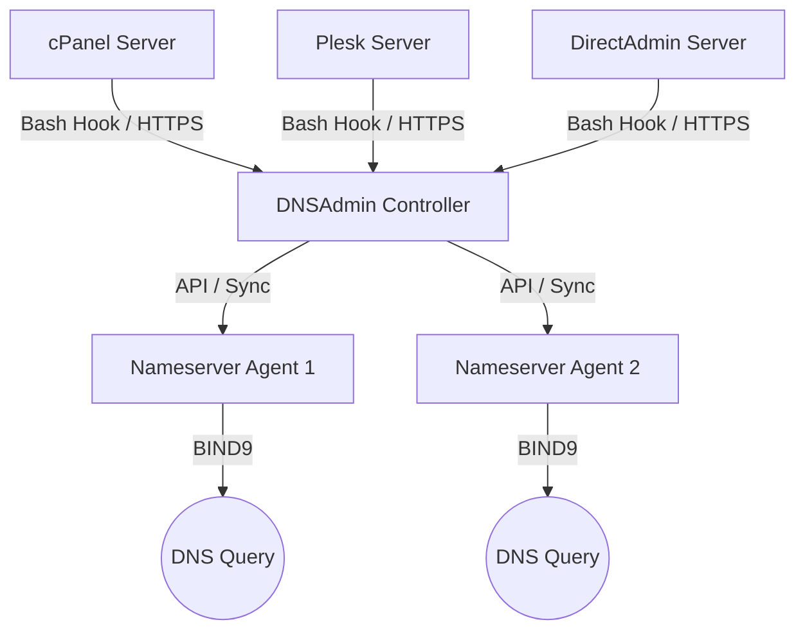

# 🌐 DNSAdmin

DNSAdmin is a secure, light-weight, centralized DNS management panel designed for web hosting providers and infrastructure administrators. It enables synchronization of DNS zones from multiple web hosting servers (cPanel, Plesk, DirectAdmin) to multiple dedicated BIND 9 nameserver nodes in real time.

---

## 🚀 Key Features

*   **Centralized DNS Management:** Sync and delete zones across multiple ad-hoc DNS nodes.
*   **MySQL Backend Support:** Swapped SQLite with a high-performance, connection-pooled MySQL/MariaDB database.
*   **Light-weight Dedicated Installers:** One-click curl installation scripts for nodes and hooks.
*   **Aesthetic Admin Panel:** Clean Bootstrap 3 AdminLTE dashboard with a persistent Light/Dark theme.
*   **OS Resource Metrics:** Real CPU and RAM utilization statistics (parsed directly from Linux `procfs` files on 60-second heartbeat loops).
*   **Strict Security Policies:** Forces password change on first login, generates secure random administrative passwords, and implements secure API routing constraints.
*   **Integrations:** Zero-dependency Bash hook scripts for cPanel, Plesk, and DirectAdmin.

---

## 🛠️ System Architecture



---

## 📦 Installation Guide

### 1. Central Controller Setup (Master Server)

Run the following command on a clean Debian/Ubuntu or RHEL/CentOS/AlmaLinux server to install Node.js, MariaDB (MySQL), configure the database, generate random passwords, and start the controller panel:

```bash
curl -sS https://raw.githubusercontent.com/bburakguldogan/dnsadmin/main/install.sh | bash -s -- --role controller --port 5380 --notify-port 53
```

*   **First Login Credentials:** During setup, a random 16-character administrator password is generated and saved in `/opt/dnsadmin-controller/admin_credentials.txt`.
*   **Forced Security Reset:** Upon logging in for the first time, you will be forced to specify a secure email address and update your password before gaining access to the dashboard.

---

### 2. DNS Nameserver Node Agent Setup (ns1/ns2)

Run this installer on your dedicated nameservers. It installs BIND 9, configures directory paths, registers the agent node service, and triggers a 60-second status reporting heartbeat:

```bash
curl -sS https://raw.githubusercontent.com/bburakguldogan/dnsadmin/main/install-node.sh | bash -s -- \
  --controller-url http://<your-controller-ip>:5380 \
  --token <node-token-from-panel> \
  --ns-name ns1.yourdomain.com
```

---

### 3. Hosting Server Integrations

To automate real-time updates when zones are added, modified, or removed on your hosting platforms:

#### A. cPanel / WHM Integration
```bash
curl -sS https://raw.githubusercontent.com/bburakguldogan/dnsadmin/main/install-cpanel.sh | bash -s -- \
  --controller-url http://<your-controller-ip>:5380 \
  --token <server-api-key-from-panel>
```

#### B. Plesk Integration
```bash
curl -sS https://raw.githubusercontent.com/bburakguldogan/dnsadmin/main/install-plesk.sh | bash -s -- \
  --controller-url http://<your-controller-ip>:5380 \
  --token <server-api-key-from-panel>
```

#### C. DirectAdmin Integration
```bash
curl -sS https://raw.githubusercontent.com/bburakguldogan/dnsadmin/main/install-directadmin.sh | bash -s -- \
  --controller-url http://<your-controller-ip>:5380 \
  --token <server-api-key-from-panel>
```

---

## 🔒 Configuration & Variables

The controller and agent daemons read configuration overrides from standard Environment variables:

### Controller Variables
*   `PORT`: Port for the admin web panel (default: `5380`)
*   `NOTIFY_PORT`: UDP port to listen for DNS NOTIFY messages (default: `5353`)
*   `MYSQL_HOST`, `MYSQL_PORT`, `MYSQL_USER`, `MYSQL_PASSWORD`, `MYSQL_DATABASE`: Credentials for database access.
*   `JWT_SECRET`: Signature key for encoding API authorization tokens.

### Node Agent Variables
*   `PORT`: Agent daemon API listener port (default: `5300`)
*   `DNSADMIN_TOKEN`: Authentication token verifying requests sent by the Controller.
*   `DNSADMIN_CONTROLLER_URL`: URL pointing to the central controller.
*   `NODE_NAME`: Node hostname reported to the controller (default: system hostname).
*   `RELOAD_CMD`: Shell command triggered to reload BIND 9 configurations.

---

## 📄 License
Private repository properties. Created and maintained by `@bburakguldogan`.
