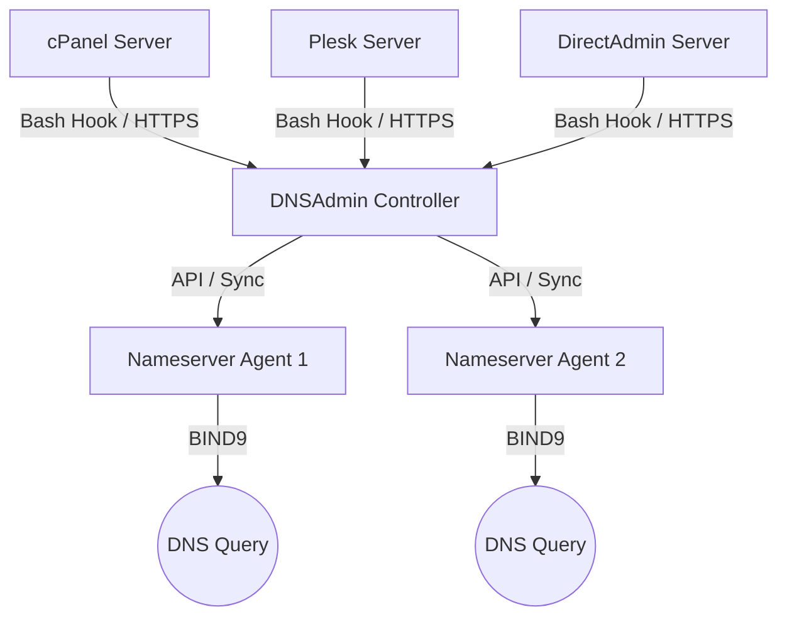

# DNSAdmin

DNSAdmin is a secure, light-weight, centralized DNS management system designed for web hosting providers and infrastructure administrators. It enables real-time synchronization of DNS zones from multiple web hosting servers (cPanel, Plesk, DirectAdmin) to multiple dedicated BIND 9 nameserver nodes.

---

## System Architecture



---

## Key Features

*   **Centralized DNS Synchronization:** Add, update, or remove zone entries across multiple remote nameserver nodes simultaneously.
*   **MySQL Database Backend:** Utilizing a high-performance, connection-pooled MySQL/MariaDB database for data persistence.
*   **Light-weight Dedicated Installers:** One-click script installers for controller, nameserver nodes, and hosting integrations.
*   **Theme Engine:** Dashboard featuring a persistent light and dark theme mode.
*   **Real-time OS Metrics:** Agent reports CPU and memory statistics parsed directly from Linux procfs files on 60-second intervals.
*   **Enforced Security Flow:** Secure password reset required on first login using randomly generated administrative credentials.
*   **Control Panel Hooks:** Zero-dependency, pure Bash hook scripts to capture zone updates from cPanel, Plesk, and DirectAdmin.

---

## Installation Guide

Follow these steps in order to set up your DNSAdmin cluster.

### 1. Central Controller Setup (Master Server)
Execute these commands on a clean Debian/Ubuntu or RHEL/CentOS/AlmaLinux server to install Node.js, MariaDB (MySQL), configure credentials, and start the control panel:

**Option A: Download and run (Recommended)**
```bash
wget -O install.sh "https://raw.githubusercontent.com/bburakguldogan/dnsadmin/main/install.sh?v=2"
chmod +x install.sh
./install.sh --role controller --port 80 --notify-port 53
```

**Option B: One-click installation**
```bash
curl -sS https://raw.githubusercontent.com/bburakguldogan/dnsadmin/main/install.sh?v=2 | bash -s -- --role controller --port 80 --notify-port 53
```

*   **First Login Credentials:** During setup, a random 16-character administrator password is generated and saved in `/opt/dnsadmin-controller/admin_credentials.txt`.
*   **Forced Security Reset:** Upon logging in for the first time, you will be forced to specify a secure email address and update your password before gaining access to the dashboard.

---

### 2. DNS Nameserver Node Agent Setup (ns1 / ns2)
First, add your nameserver node in the central dashboard under the "DNS Nodes" tab to generate a unique **Node Token**. Then, run the following commands on your nameserver server:

**Option A: Download and run (Recommended)**
```bash
wget -O install-node.sh "https://raw.githubusercontent.com/bburakguldogan/dnsadmin/main/install-node.sh?v=2"
chmod +x install-node.sh
./install-node.sh --controller-url http://<your-controller-ip>:80 --token <node-token-from-panel> --ns-name ns1.yourdomain.com
```

**Option B: One-click installation**
```bash
curl -sS https://raw.githubusercontent.com/bburakguldogan/dnsadmin/main/install-node.sh?v=2 | bash -s -- \
  --controller-url http://<your-controller-ip>:80 \
  --token <node-token-from-panel> \
  --ns-name ns1.yourdomain.com
```

*   If BIND 9 is not installed on the node, the installer will automatically provision BIND 9 packages, start the daemon, and link the configuration files.

---

### 3. Hosting Server Integrations (Hooks)
Add your hosting server under the "Hosting Servers" tab to obtain a **Server API Key**. Then run the corresponding hook installer script on your hosting server:

#### A. cPanel / WHM Integration
```bash
wget -O install-cpanel.sh "https://raw.githubusercontent.com/bburakguldogan/dnsadmin/main/install-cpanel.sh?v=2"
chmod +x install-cpanel.sh
./install-cpanel.sh --controller-url http://<your-controller-ip>:80 --token <server-api-key-from-panel>
```

#### B. Plesk Integration
```bash
wget -O install-plesk.sh "https://raw.githubusercontent.com/bburakguldogan/dnsadmin/main/install-plesk.sh?v=2"
chmod +x install-plesk.sh
./install-plesk.sh --controller-url http://<your-controller-ip>:80 --token <server-api-key-from-panel>
```

#### C. DirectAdmin Integration
```bash
wget -O install-directadmin.sh "https://raw.githubusercontent.com/bburakguldogan/dnsadmin/main/install-directadmin.sh?v=2"
chmod +x install-directadmin.sh
./install-directadmin.sh --controller-url http://<your-controller-ip>:80 --token <server-api-key-from-panel>
```

---

## Configuration & Environment Variables

The controller and agent daemons read configuration overrides from the following environment variables:

### Controller Variables
*   `PORT`: Port for the admin web panel (default: `5380`)
*   `NOTIFY_PORT`: UDP port to listen for DNS NOTIFY messages (default: `5353`)
*   `MYSQL_HOST`, `MYSQL_PORT`, `MYSQL_USER`, `MYSQL_PASSWORD`, `MYSQL_DATABASE`: Credentials for database access.
*   `JWT_SECRET`: Signature key for encoding API authorization tokens.

### Node Agent Variables
*   `PORT`: Agent daemon API listener port (default: `5300`)
*   `DNSADMIN_TOKEN`: Authentication token verifying requests sent by the Controller.
*   `DNSADMIN_CONTROLLER_URL`: URL pointing to the central controller.
*   `NODE_NAME`: Node hostname reported to the controller (default: system hostname).
*   `RELOAD_CMD`: Shell command triggered to reload BIND 9 configurations.

---

## License
Private repository properties. Created and maintained by `@bburakguldogan`.
